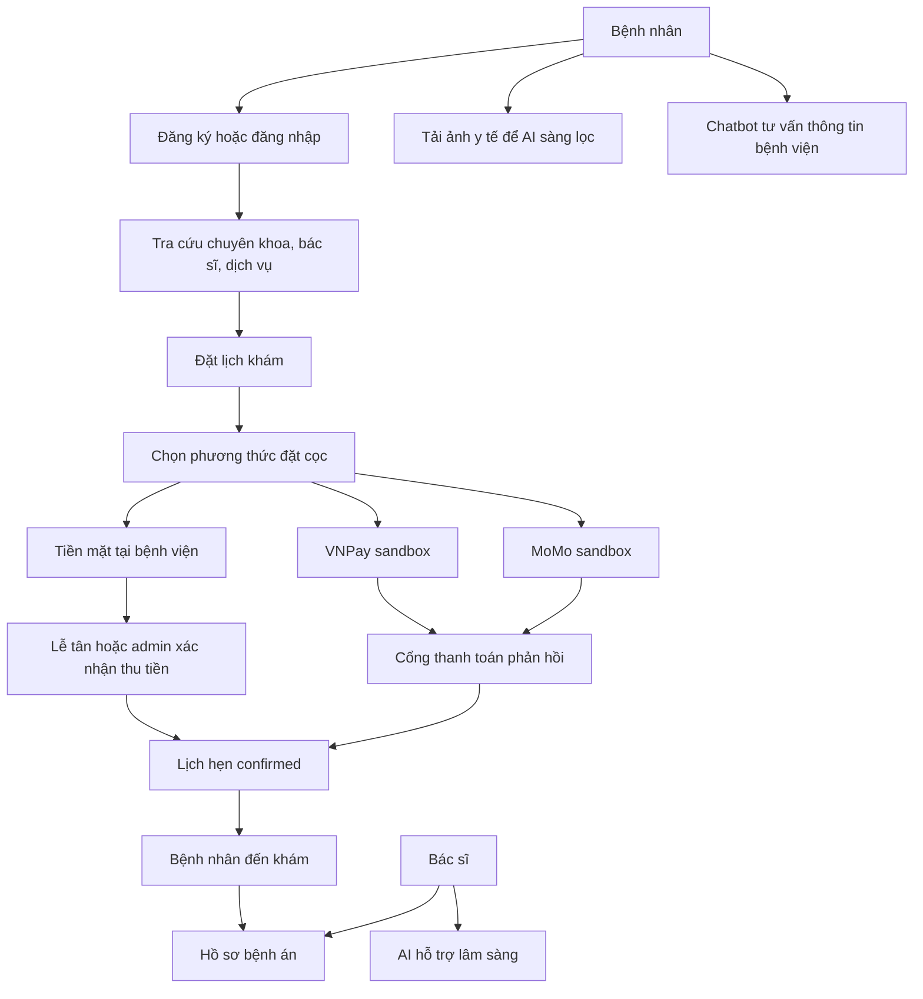
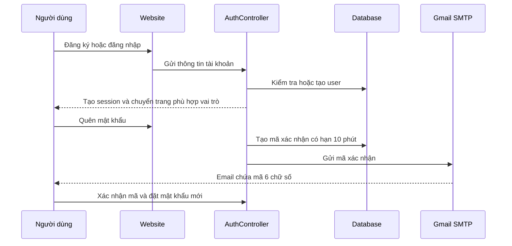
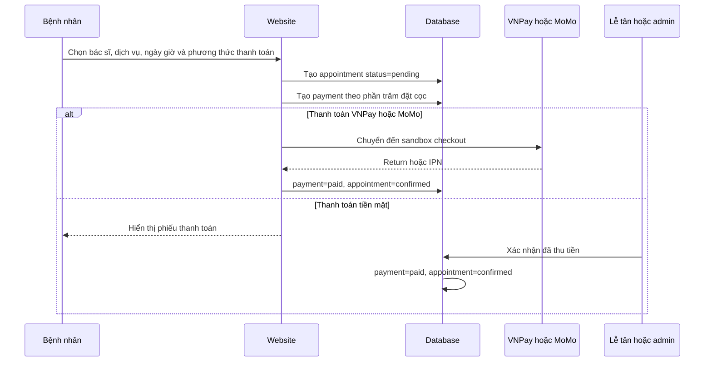
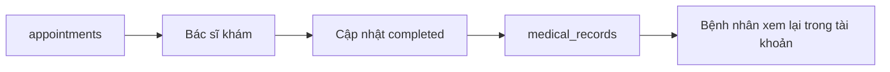

# Hospital Backend

Hệ thống quản lý bệnh viện xây dựng bằng Laravel. Dự án cung cấp giao diện web và REST API cho các nghiệp vụ: quản lý chuyên khoa, bác sĩ, dịch vụ, đặt lịch khám, thanh toán đặt cọc, hồ sơ bệnh án, liên hệ, chatbot và AI hỗ trợ y tế.

## Deploy Lên Render

Dự án có sẵn `Dockerfile` và `render.yaml` để deploy Laravel cùng PostgreSQL:

1. Commit và push mã nguồn lên GitHub.
2. Chạy `php artisan key:generate --show` ở máy local và giữ lại kết quả.
3. Đăng nhập Render, chọn **New > Blueprint**, kết nối repository và chọn file `render.yaml`.
4. Khi Render yêu cầu biến môi trường, nhập:
   - `APP_KEY`: kết quả ở bước 2.
   - `APP_URL`: URL Render cấp, ví dụ `https://hospital-backend.onrender.com`.
5. Nếu cần dữ liệu mẫu trong lần deploy đầu tiên, đổi `SEED_DATABASE=true` trên Render rồi deploy lại. Ngay sau khi deploy thành công, đổi biến này về `false`.

Seeder sẽ xóa và tạo lại dữ liệu nghiệp vụ mỗi lần container khởi động, vì vậy không để `SEED_DATABASE=true` sau lần seed đầu tiên và không bật trên hệ thống đã có dữ liệu thật.

Container tự chạy `php artisan migrate --force` khi khởi động và Render kiểm tra ứng dụng qua `/up`.

Gói Render miễn phí dùng filesystem tạm thời. Ảnh người dùng upload sẽ mất khi service restart hoặc deploy lại; PostgreSQL miễn phí cũng hết hạn sau 30 ngày. Khi vận hành thật, dùng PostgreSQL trả phí và cấu hình object storage như S3 hoặc gắn persistent disk vào `storage/app/public`.

## Vai Trò Trong Hệ Thống

| Vai trò | Chức năng chính |
| --- | --- |
| Bệnh nhân (`patient`) | Đăng ký, tra cứu thông tin, đặt lịch, thanh toán đặt cọc, xem lịch sử khám, tải ảnh y tế để AI hỗ trợ sàng lọc |
| Bác sĩ (`doctor`) | Xem hồ sơ khám liên quan và dùng AI để hỗ trợ tóm tắt, gợi ý chẩn đoán phân biệt, kiểm tra đơn thuốc hoặc soạn bệnh án |
| Lễ tân (`receptionist`) | Quản lý lịch hẹn, bệnh nhân, thanh toán và liên hệ khách hàng |
| Quản trị viên (`admin`) | Quản lý toàn bộ dữ liệu hệ thống và có quyền vận hành như lễ tân |

## Sơ Đồ Tổng Quan



## Luồng Hoạt Động Chính

### 1. Khởi Tạo Dữ Liệu Nền

Admin chuẩn bị dữ liệu để hệ thống có thể nhận lịch khám:

1. Tạo tài khoản người dùng theo vai trò.
2. Tạo chuyên khoa.
3. Tạo hồ sơ bác sĩ và liên kết bác sĩ với chuyên khoa.
4. Tạo lịch làm việc theo thứ trong tuần, giờ khám, phòng và số bệnh nhân tối đa.
5. Tạo dịch vụ, giá và thời lượng khám.
6. Quản lý tin tức, banner và thông tin liên hệ.

Các bảng dữ liệu chính:

| Bảng | Nội dung |
| --- | --- |
| `users` | Tài khoản, vai trò và thông tin cá nhân |
| `departments` | Chuyên khoa |
| `doctors` | Hồ sơ chuyên môn của bác sĩ |
| `doctor_schedules` | Lịch làm việc của bác sĩ |
| `services` | Dịch vụ khám chữa bệnh |
| `appointments` | Lịch hẹn khám |
| `payments` | Thanh toán đặt cọc của lịch hẹn |
| `medical_records` | Hồ sơ bệnh án sau khi khám |
| `medical_images` | Ảnh y tế và kết quả AI hỗ trợ sàng lọc |
| `contacts` | Yêu cầu liên hệ từ người dùng |
| `news`, `banners` | Nội dung hiển thị trên website |

### 2. Đăng Ký, Đăng Nhập Và Khôi Phục Mật Khẩu



- Người dùng đăng ký từ website luôn được gán vai trò `patient`.
- Sau khi đăng nhập, `admin` và `receptionist` được chuyển vào trang quản trị; `patient` và `doctor` được chuyển vào trang chủ.
- Luồng quên mật khẩu yêu cầu cấu hình Gmail SMTP thật qua `MAIL_USERNAME` và `MAIL_PASSWORD`.
- REST API dùng Bearer token qua `/api/auth/login`; website dùng session Laravel.

### 3. Tra Cứu Thông Tin Bệnh Viện

Sau khi đăng nhập website, người dùng có thể:

1. Xem trang chủ với banner, chuyên khoa, bác sĩ, dịch vụ và tin tức nổi bật.
2. Tìm chuyên khoa theo tên hoặc mô tả.
3. Lọc bác sĩ theo chuyên khoa, tên, chuyên môn hoặc học vị.
4. Xem lịch làm việc còn khả dụng của bác sĩ.
5. Lọc dịch vụ theo chuyên khoa.
6. Xem tin tức đã xuất bản.
7. Gửi yêu cầu liên hệ để bệnh viện xử lý.

Các REST API tra cứu tương ứng vẫn được mở công khai: `/api/home`, `/api/departments`, `/api/doctors`, `/api/doctor-schedules`, `/api/services`, `/api/news`, `/api/banners`.

### 4. Đặt Lịch Và Thanh Toán Đặt Cọc



Chi tiết nghiệp vụ:

1. Bệnh nhân vào `/dat-lich-kham`.
2. Bệnh nhân chọn bác sĩ, dịch vụ, lịch làm việc nếu có, ngày giờ khám và nhập thông tin người khám.
3. Hệ thống tạo lịch hẹn với trạng thái `pending`.
4. Hệ thống tính tiền đặt cọc từ giá dịch vụ. Mặc định đặt cọc `30%`, cấu hình bằng `PAYMENT_DEPOSIT_PERCENT`.
5. Nếu chọn `cash`, thanh toán ở trạng thái `unpaid` cho đến khi lễ tân hoặc admin xác nhận thu tiền.
6. Nếu chọn `vnpay` hoặc `momo`, người dùng được chuyển sang cổng sandbox.
7. Khi thanh toán thành công, thanh toán chuyển sang `paid` và lịch hẹn tự động chuyển sang `confirmed`.
8. Khi hủy thanh toán, lịch hẹn liên quan cũng chuyển sang `cancelled`.

Trạng thái lịch hẹn:

| Trạng thái | Ý nghĩa |
| --- | --- |
| `pending` | Đã tạo lịch, đang chờ xử lý hoặc chờ đặt cọc |
| `confirmed` | Đã xác nhận lịch |
| `cancelled` | Lịch đã bị hủy |
| `completed` | Buổi khám đã hoàn thành |

Trạng thái thanh toán:

| Trạng thái | Ý nghĩa |
| --- | --- |
| `unpaid` | Chưa thu tiền mặt |
| `pending` | Đang chờ kết quả từ cổng thanh toán |
| `paid` | Đã thanh toán đặt cọc |
| `failed` | Thanh toán qua cổng thất bại |
| `cancelled` | Thanh toán đã hủy |
| `refunded` | Đã hoàn tiền |

### 5. Lễ Tân Và Admin Vận Hành

Lễ tân và admin truy cập `/admin` để:

1. Theo dõi dashboard và các lịch hẹn mới.
2. Tra cứu bệnh nhân, bác sĩ, chuyên khoa, lịch làm việc và dịch vụ.
3. Tạo hoặc chỉnh sửa lịch hẹn.
4. Cập nhật trạng thái lịch hẹn.
5. Theo dõi giao dịch và xác nhận tiền mặt.
6. Hủy thanh toán khi cần.
7. Đọc và cập nhật trạng thái liên hệ: `new`, `read`, `replied`.

Theo route web hiện tại, cả `admin` và `receptionist` đều có thể vào các màn hình CRUD quản trị: tài khoản, bệnh nhân, chuyên khoa, bác sĩ, lịch làm việc, dịch vụ, lịch hẹn, hồ sơ khám, tin tức và liên hệ. REST API tách quyền chi tiết hơn: `/api/staff/*` dành cho nghiệp vụ vận hành và `/api/admin/*` dành cho CRUD toàn bộ tài nguyên.

### 6. Khám Bệnh Và Hồ Sơ Bệnh Án



Sau khi khám:

1. Bác sĩ hoặc nhân viên có quyền cập nhật lịch thành `completed`.
2. Hồ sơ khám lưu triệu chứng, chẩn đoán, hướng điều trị, đơn thuốc, ghi chú và lịch tái khám.
3. Bệnh nhân xem lịch hẹn và hồ sơ khám gần nhất tại `/tai-khoan`.
4. REST API cho bệnh nhân nằm trong `/api/patient/*`; API cho bác sĩ nằm trong `/api/doctor/*`.

### 7. Chatbot Tư Vấn Khách Hàng

Website gửi câu hỏi tới:

```http
POST /tro-ly-ai
```

Chatbot chỉ hỗ trợ thông tin bệnh viện: đặt lịch, chuyên khoa, bác sĩ, dịch vụ, giá tham khảo, thanh toán và liên hệ.

- Nếu có `OPENAI_API_KEY`, chatbot gọi OpenAI Responses API.
- Nếu chưa cấu hình OpenAI hoặc API lỗi, hệ thống dùng câu trả lời fallback theo từ khóa.
- Chatbot không chẩn đoán bệnh và không kê đơn.

### 8. AI Hỗ Trợ Bác Sĩ

Bác sĩ dùng chức năng AI tại trang tài khoản. Endpoint:

```http
POST /ai-ho-tro-bac-si
```

Chỉ tài khoản `doctor` được phép gọi endpoint này.

| Chế độ | Mục đích |
| --- | --- |
| `diagnosis` | Gợi ý khả năng bệnh và chẩn đoán phân biệt |
| `summary` | Tóm tắt bệnh án |
| `prescription` | Cảnh báo dị ứng, tương tác, liều bất thường hoặc chống chỉ định |
| `record_draft` | Soạn bản nháp bệnh án có cấu trúc |

Provider được chọn bằng `AI_PROVIDER=openai` hoặc `AI_PROVIDER=gemini`. AI chỉ đưa ra gợi ý tham khảo; bác sĩ là người quyết định cuối cùng.

### 9. AI Hỗ Trợ Sàng Lọc Ảnh Y Tế

Bệnh nhân tải ảnh từ trang tài khoản qua:

```http
POST /anh-y-te
```

Luồng xử lý:

1. Hệ thống chỉ nhận ảnh `jpg`, `jpeg`, `png`, `webp`, tối đa `8 MB`.
2. Bệnh nhân chọn loại ảnh: `xray`, `ct`, `mri`, `ultrasound` hoặc `endoscopy`.
3. File được lưu trong `storage/app/public/medical-images/{user_id}`.
4. Hệ thống tạo bản ghi `medical_images` với trạng thái `pending`.
5. Service AI phân tích ảnh bằng provider cấu hình trong `MEDICAL_IMAGE_AI_PROVIDER`.
6. Kết quả được lưu vào `summary`, `findings`, `analysis_status` và hiển thị trong trang tài khoản.

Provider hỗ trợ:

| Provider | Cấu hình | Cách hoạt động |
| --- | --- | --- |
| `gemini` | `GEMINI_API_KEY` | Gửi ảnh đến Gemini Vision để tạo nhận xét dễ hiểu cho bệnh nhân |
| `yolo` | `MEDICAL_IMAGE_AI_URL` | Gửi ảnh đến service YOLO nội bộ, mặc định `http://127.0.0.1:9000/predict` |

Kết quả AI chỉ dùng để tham khảo và cần bác sĩ xác nhận.

## REST API Theo Nhóm Quyền

| Nhóm | Prefix | Mục đích |
| --- | --- | --- |
| Public | `/api/*` | Tra cứu dữ liệu, đăng ký, đăng nhập, gửi liên hệ, tạo lịch và nhận IPN thanh toán |
| Bệnh nhân | `/api/patient/*` | Xem, tạo, hủy lịch và xem hồ sơ bệnh án của bệnh nhân |
| Bác sĩ | `/api/doctor/*` | Xem lịch, cập nhật trạng thái và quản lý hồ sơ bệnh án |
| Nhân viên | `/api/staff/*` | Quản lý lịch, bệnh nhân, thanh toán, liên hệ và xem thống kê |
| Admin | `/api/admin/*` | CRUD toàn bộ tài nguyên quản trị |

Xem danh sách route đầy đủ:

```bash
php artisan route:list
```

## Cài Đặt

Yêu cầu:

- PHP `^8.3`
- Composer
- Node.js và npm

Chạy dự án:

```bash
composer install
Copy-Item .env.example .env
php artisan key:generate
php artisan migrate --seed
php artisan storage:link
npm install
npm run build
php artisan serve
```

Truy cập:

```text
http://127.0.0.1:8000
```

Tài khoản seed mẫu, mật khẩu chung là `password`:

| Vai trò | Email |
| --- | --- |
| Admin | `admin@hospital.test` |
| Lễ tân | `receptionist@hospital.test` |
| Bệnh nhân | `patient@hospital.test` |
| Bác sĩ | `doctor.timmach@hospital.test` |
| Bác sĩ | `doctor.nhikhoa@hospital.test` |

## Cấu Hình Tùy Chọn

Các chức năng ngoài luồng cơ bản cần cấu hình thêm trong `.env`:

| Chức năng | Biến môi trường chính |
| --- | --- |
| Gửi mã quên mật khẩu | `MAIL_USERNAME`, `MAIL_PASSWORD` |
| VNPay sandbox | `VNPAY_TMN_CODE`, `VNPAY_HASH_SECRET` |
| MoMo sandbox | `MOMO_PARTNER_CODE`, `MOMO_ACCESS_KEY`, `MOMO_SECRET_KEY` |
| Chatbot OpenAI | `OPENAI_API_KEY`, `OPENAI_MODEL` |
| AI hỗ trợ bác sĩ | `AI_PROVIDER`, `OPENAI_API_KEY` hoặc `GEMINI_API_KEY` |
| Ảnh y tế Gemini | `MEDICAL_IMAGE_AI_PROVIDER=gemini`, `GEMINI_API_KEY` |
| Ảnh y tế YOLO | `MEDICAL_IMAGE_AI_PROVIDER=yolo`, `MEDICAL_IMAGE_AI_URL` |

Service YOLO mẫu nằm trong:

```text
ai-services/medical-yolo
```

## Kiểm Tra

```bash
php artisan route:list
php artisan test
```
https://dashboard.render.com/web/srv-d8ik4lbtqb8s73b8l02g/events
https://hospital-backend-87l5.onrender.com/