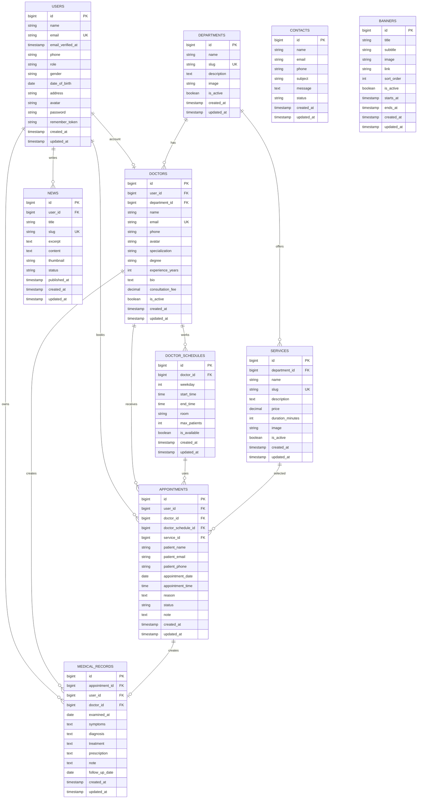
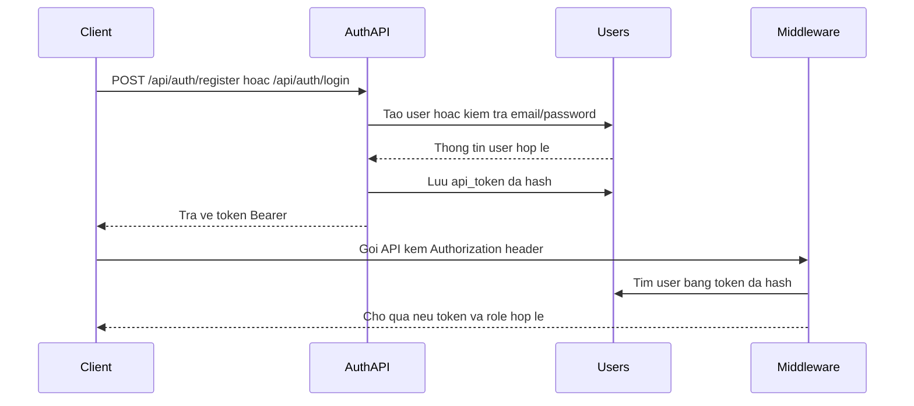
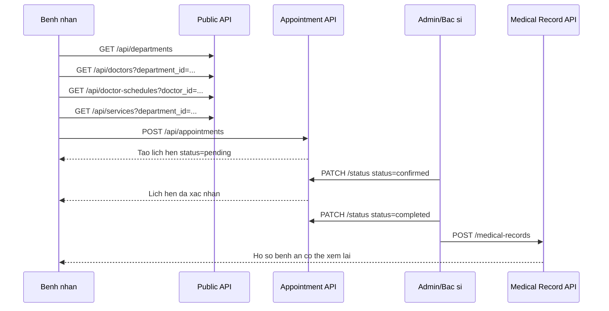

# Hospital Backend

## Use Case Diagram

```mermaid
flowchart LR
    visitor[Khach truy cap]
    patient[Benh nhan]
    doctor[Bac si]
    admin[Quan tri vien]

    subgraph system[He thong quan ly benh vien]
        register((Dang ky / Dang nhap))
        viewContent((Xem banner, tin tuc))
        viewCatalog((Xem khoa, bac si, dich vu))
        sendContact((Gui lien he))
        bookAppointment((Dat lich kham))
        manageProfile((Quan ly ho so ca nhan))
        viewAppointments((Xem lich hen))
        cancelAppointment((Huy lich hen))
        viewMedicalRecords((Xem ho so benh an))

        viewDoctorSchedule((Xem lich lam viec))
        manageDoctorSchedule((Quan ly lich lam viec))
        handleAppointment((Xac nhan / cap nhat lich hen))
        createMedicalRecord((Lap ho so benh an))

        manageUsers((Quan ly nguoi dung))
        manageDepartments((Quan ly khoa))
        manageDoctors((Quan ly bac si))
        manageServices((Quan ly dich vu))
        manageNews((Quan ly tin tuc))
        manageContacts((Quan ly lien he))
        manageBanners((Quan ly banner))
        manageMedicalRecords((Quan ly ho so benh an))
    end

    visitor --> viewContent
    visitor --> viewCatalog
    visitor --> sendContact
    visitor --> register
    visitor --> bookAppointment

    patient --> register
    patient --> manageProfile
    patient --> viewCatalog
    patient --> bookAppointment
    patient --> viewAppointments
    patient --> cancelAppointment
    patient --> viewMedicalRecords
    patient --> sendContact

    doctor --> viewDoctorSchedule
    doctor --> manageDoctorSchedule
    doctor --> viewAppointments
    doctor --> handleAppointment
    doctor --> createMedicalRecord

    admin --> manageUsers
    admin --> manageDepartments
    admin --> manageDoctors
    admin --> manageDoctorSchedule
    admin --> manageServices
    admin --> handleAppointment
    admin --> manageMedicalRecords
    admin --> manageNews
    admin --> manageContacts
    admin --> manageBanners
```



## Database Diagram



## Actors

- `Khach truy cap`: nguoi chua dang nhap, co the xem thong tin cong khai, gui lien he va dat lich kham neu he thong cho phep dat lich khong can tai khoan.
- `Benh nhan`: nguoi dung co tai khoan vai tro `patient`, co the quan ly ho so ca nhan, dat lich, xem lich hen va xem ho so benh an cua minh.
- `Bac si`: nguoi dung co vai tro `doctor`, co the xem lich lam viec, xu ly lich hen va lap ho so benh an.
- `Quan tri vien`: nguoi dung co vai tro `admin`, quan ly toan bo du lieu he thong.

## Database Mapping

- `users`: tai khoan dang nhap, thong tin ca nhan va vai tro nguoi dung.
- `departments`: khoa/phong ban trong benh vien.
- `doctors`: ho so bac si, lien ket voi `users` va `departments`.
- `doctor_schedules`: lich lam viec cua bac si.
- `services`: dich vu kham/chua benh.
- `appointments`: lich hen kham cua benh nhan voi bac si/dich vu.
- `medical_records`: ho so benh an sau khi kham.
- `news`: bai viet, tin tuc cua benh vien.
- `contacts`: thong tin lien he/phan hoi tu nguoi dung.
- `banners`: banner hien thi tren website.

## Main Workflow

1. Khach truy cap hoac benh nhan xem khoa, bac si, dich vu va tin tuc.
2. Benh nhan dat lich kham voi bac si theo lich lam viec.
3. Bac si hoac quan tri vien xac nhan va cap nhat trang thai lich hen.
4. Sau khi kham, bac si lap ho so benh an cho lich hen.
5. Quan tri vien quan ly du lieu nen nhu khoa, bac si, dich vu, tin tuc, lien he va banner.

## Luong Hoat Dong Chi Tiet

### 1. Khoi Tao Va Quan Ly Du Lieu Nen

Luong nay do `admin` thuc hien de he thong co du du lieu cho nguoi dung dat lich:

1. Admin dang nhap bang `POST /api/auth/login`.
2. He thong tra ve token Bearer va thong tin tai khoan co vai tro `admin`.
3. Admin tao hoac cap nhat khoa bang `/api/admin/departments`.
4. Admin tao tai khoan bac si trong `/api/admin/users` voi `role = doctor`.
5. Admin tao ho so bac si trong `/api/admin/doctors`, lien ket `user_id` voi tai khoan bac si va `department_id` voi khoa.
6. Admin tao lich lam viec trong `/api/admin/doctor-schedules`, gom thu trong tuan, gio bat dau, gio ket thuc, phong kham va so benh nhan toi da.
7. Admin tao dich vu kham trong `/api/admin/services`, co the gan dich vu vao mot khoa.
8. Admin tao banner va tin tuc trong `/api/admin/banners`, `/api/admin/news`.
9. Cac du lieu dang hoat dong se duoc lay len trang public qua `/api/home`, `/api/departments`, `/api/doctors`, `/api/services`, `/api/news`.

Du lieu nen quan trong:

| Du lieu | Bang | Vai tro trong he thong |
| --- | --- | --- |
| Tai khoan | `users` | Dang nhap, phan quyen, thong tin ca nhan |
| Khoa | `departments` | Nhom bac si va dich vu theo chuyen mon |
| Bac si | `doctors` | Ho so chuyen mon va bac si nhan lich kham |
| Lich lam viec | `doctor_schedules` | Khung gio bac si co the kham |
| Dich vu | `services` | Goi kham/chua benh nguoi dung co the chon |
| Banner, tin tuc | `banners`, `news` | Noi dung hien thi trang chu va truyen thong |

### 2. Luong Khach Truy Cap Website

Khach truy cap co the xem thong tin cong khai ma khong can token:

1. Frontend goi `GET /api/home` de lay banner, khoa noi bat, bac si noi bat, dich vu va tin tuc moi.
2. Khi nguoi dung vao trang khoa, frontend goi `GET /api/departments` hoac `GET /api/departments/{id}`.
3. Khi nguoi dung tim bac si, frontend goi `GET /api/doctors?search=...` hoac `GET /api/doctors?department_id=...`.
4. Khi nguoi dung xem lich bac si, frontend goi `GET /api/doctor-schedules?doctor_id=...&available=true`.
5. Khi nguoi dung xem dich vu, frontend goi `GET /api/services?department_id=...`.
6. Khi nguoi dung doc tin tuc, frontend goi `GET /api/news?published=true` va `GET /api/news/{id-or-slug}`.
7. Neu nguoi dung can tu van, frontend gui `POST /api/contacts`; ban ghi moi co `status = new`.
8. Neu dat lich khong bat buoc dang nhap, frontend co the gui truc tiep `POST /api/appointments`; neu da dang nhap thi gui kem `user_id` cua benh nhan.

### 3. Luong Dang Ky, Dang Nhap Va Phan Quyen



Chi tiet:

1. `POST /api/auth/register` tao tai khoan benh nhan moi voi `role = patient`.
2. `POST /api/auth/login` kiem tra email va password.
3. Neu hop le, backend sinh token ngau nhien, luu ban hash vao cot `api_token` cua `users`.
4. Client luu token va gui header `Authorization: Bearer <token>` cho API can dang nhap.
5. Middleware `auth.api` hash token gui len va tim user tuong ung.
6. Middleware `role` kiem tra role co nam trong danh sach duoc phep hay khong.
7. `POST /api/auth/logout` xoa `api_token`, token cu khong con dung duoc.

Quyen truy cap:

| Vai tro | Khu vuc API | Muc dich |
| --- | --- | --- |
| `visitor` | Public API | Xem thong tin, gui lien he, dat lich public |
| `patient` | `/api/patient/*` | Xem/huy lich hen va xem ho so benh an cua benh nhan |
| `doctor` | `/api/doctor/*` | Xu ly lich kham va lap ho so benh an |
| `admin` | `/api/admin/*`, `/api/patient/*`, `/api/doctor/*` | Quan ly toan he thong va ho tro van hanh |

### 4. Luong Dat Lich Kham



Chi tiet nghiep vu:

1. Benh nhan chon khoa can kham tu `/api/departments`.
2. He thong loc danh sach bac si theo `department_id`.
3. Benh nhan xem chi tiet bac si, chuyen mon, kinh nghiem, phi tu van va lich lam viec.
4. Benh nhan chon lich lam viec phu hop theo `doctor_schedule_id`.
5. Benh nhan chon dich vu kham neu co.
6. Benh nhan nhap thong tin nguoi kham, ngay kham, gio kham va ly do kham.
7. Frontend gui `POST /api/appointments`.
8. Backend validate `doctor_id`, `doctor_schedule_id`, `service_id`, ngay gio va thong tin lien he.
9. Backend tao ban ghi trong `appointments`, mac dinh `status = pending`.
10. Admin hoac bac si xem lich moi qua `/api/admin/appointments` hoac `/api/doctor/appointments`.
11. Admin hoac bac si xac nhan bang `PATCH /api/admin/appointments/{id}/status` hoac `PATCH /api/doctor/appointments/{id}/status`.
12. Khi lich duoc xac nhan, `status` chuyen thanh `confirmed`.
13. Neu lich bi huy, `status` chuyen thanh `cancelled` va co the luu ly do trong `note`.
14. Sau khi kham xong, bac si hoac admin chuyen `status` thanh `completed`.
15. Bac si tao ho so benh an bang `POST /api/doctor/medical-records`.
16. Benh nhan xem lai lich va ho so benh an trong nhom `/api/patient/*`.

### 5. Vong Doi Trang Thai Lich Hen

| Trang thai | Nguoi cap nhat | Y nghia | Buoc tiep theo |
| --- | --- | --- | --- |
| `pending` | He thong khi tao lich | Lich vua duoc gui, chua duoc duyet | Bac si/admin xac nhan hoac huy |
| `confirmed` | Bac si hoac admin | Lich da duoc chap nhan | Benh nhan den kham, sau do hoan thanh |
| `cancelled` | Benh nhan, bac si hoac admin | Lich bi huy truoc khi hoan tat | Ket thuc luong lich hen |
| `completed` | Bac si hoac admin | Buoi kham da hoan thanh | Bac si lap ho so benh an |

Rang buoc hien tai:

- Benh nhan chi huy lich qua `PATCH /api/patient/appointments/{id}/cancel`.
- Lich da `completed` khong the huy bang API benh nhan.
- Bac si va admin cap nhat trang thai qua endpoint `/status`.
- Ho so benh an nen duoc tao sau khi lich kham da hoan thanh.
- Moi lich hen co toi da mot ho so benh an thong qua `appointment_id` duy nhat trong `medical_records`.

### 6. Luong Benh Nhan Sau Khi Dang Nhap

1. Benh nhan dang nhap va lay token.
2. Frontend goi `GET /api/auth/me` de lay thong tin tai khoan hien tai.
3. Benh nhan xem danh sach lich hen bang `GET /api/patient/appointments?user_id={id}`.
4. Benh nhan loc lich hen theo `status`, `date`, `from`, `to` khi can xem lich su.
5. Benh nhan xem chi tiet lich bang `GET /api/patient/appointments/{id}`.
6. Neu lich chua hoan thanh, benh nhan huy bang `PATCH /api/patient/appointments/{id}/cancel`.
7. Sau khi bac si tao ho so benh an, benh nhan xem danh sach bang `GET /api/patient/medical-records?user_id={id}`.
8. Benh nhan xem chi tiet ho so bang `GET /api/patient/medical-records/{id}`.

### 7. Luong Bac Si Xu Ly Lich Kham

1. Bac si dang nhap bang tai khoan co `role = doctor`.
2. Backend tra ve thong tin user kem quan he `doctor`, frontend lay duoc `doctor.id`.
3. Bac si xem lich kham bang `GET /api/doctor/appointments?doctor_id={doctor_id}`.
4. Bac si loc theo ngay bang `date=YYYY-MM-DD` hoac loc theo trang thai bang `status=pending`.
5. Bac si mo chi tiet lich de xem thong tin benh nhan, dich vu va ly do kham.
6. Bac si xac nhan lich bang `PATCH /api/doctor/appointments/{id}/status` voi `status = confirmed`.
7. Neu khong the tiep nhan, bac si cap nhat `status = cancelled` va ghi ly do trong `note`.
8. Sau khi kham xong, bac si cap nhat `status = completed`.
9. Bac si tao ho so benh an bang `POST /api/doctor/medical-records`.
10. Neu can bo sung ket qua, bac si cap nhat ho so bang `PUT/PATCH /api/doctor/medical-records/{id}`.

### 8. Luong Quan Tri He Thong

Admin la vai tro quan ly toan bo du lieu:

1. Dang nhap va lay token admin.
2. Quan ly tai khoan nguoi dung: tao benh nhan, bac si, admin; sua thong tin; xoa tai khoan khong con dung.
3. Quan ly khoa: tao khoa moi, cap nhat mo ta, anh, trang thai hoat dong.
4. Quan ly bac si: gan bac si voi tai khoan va khoa, cap nhat chuyen mon, hoc vi, phi tu van.
5. Quan ly lich lam viec: tao ca kham theo thu, gio, phong va so luong toi da.
6. Quan ly dich vu: tao dich vu, gan khoa, gia tien, thoi luong va trang thai.
7. Quan ly lich hen: xem toan bo lich, loc theo bac si, benh nhan, dich vu, ngay va trang thai.
8. Duyet lich hen bang `PATCH /api/admin/appointments/{id}/status`.
9. Quan ly ho so benh an khi can ho tro tra cuu hoac chinh sua.
10. Quan ly tin tuc, banner va lien he tu nguoi dung.
11. Xem thong ke dat lich bang `GET /api/admin/statistics/appointments`.

### 9. Luong Lien He Va Cham Soc Khach Hang

1. Khach truy cap gui form lien he qua `POST /api/contacts`.
2. Backend tao ban ghi `contacts` voi `status = new`.
3. Admin xem danh sach lien he bang `GET /api/admin/contacts?status=new`.
4. Admin xem chi tiet noi dung lien he bang `GET /api/admin/contacts/{id}`.
5. Sau khi da doc hoac phan hoi, admin cap nhat `status = read` hoac `status = replied`.
6. Neu lien he khong con can luu, admin co the xoa bang `DELETE /api/admin/contacts/{id}`.

### 10. Luong Hien Thi Trang Chu

`GET /api/home` gom du lieu tu nhieu bang de frontend render trang chu:

| Truong response | Nguon du lieu | Dieu kien lay |
| --- | --- | --- |
| `banners` | `banners` | `is_active = true`, sap xep theo `sort_order`, gioi han 5 |
| `departments` | `departments` | `is_active = true`, kem so bac si, gioi han 8 |
| `doctors` | `doctors` | `is_active = true`, kem khoa, gioi han 8 |
| `services` | `services` | `is_active = true`, kem khoa, gioi han 8 |
| `news` | `news` | `status = published`, sap xep theo `published_at`, gioi han 6 |

### 11. Luong Du Lieu Tu Dat Lich Den Benh An

```text
users
  -> appointments
      -> medical_records

departments
  -> doctors
      -> doctor_schedules
      -> appointments
      -> medical_records

services
  -> appointments
```

Y nghia lien ket:

- `users.id` duoc luu vao `appointments.user_id` neu nguoi dat lich co tai khoan.
- `doctors.id` duoc luu vao `appointments.doctor_id` de xac dinh bac si kham.
- `doctor_schedules.id` duoc luu vao `appointments.doctor_schedule_id` de biet khung gio lam viec.
- `services.id` duoc luu vao `appointments.service_id` neu lich hen co chon dich vu.
- Sau khi kham, `medical_records.appointment_id` lien ket ket qua kham voi lich hen.
- `medical_records.user_id` va `medical_records.doctor_id` giup tra cuu nhanh theo benh nhan hoac bac si.


## Doi Tuong Su Dung

### Benh nhan / Nguoi dung

- Xem thong tin benh vien thong qua trang chu, banner, gioi thieu va tin tuc.
- Tim bac si theo ten, chuyen khoa, kinh nghiem hoac dich vu kham.
- Xem danh sach chuyen khoa va thong tin chi tiet cua tung khoa.
- Dat lich kham theo bac si, ngay kham, gio kham va dich vu.
- Xem danh sach lich hen va lich su dat lich cua minh.
- Huy lich hen khi lich hen chua hoan thanh.
- Xem ho so benh an sau khi bac si cap nhat ket qua kham.
- Gui phan hoi, cau hoi hoac yeu cau lien he den benh vien.

### Bac si

- Dang nhap bang tai khoan co vai tro `doctor`.
- Xem danh sach lich kham duoc gan cho minh.
- Loc lich kham theo ngay va theo trang thai.
- Xem thong tin benh nhan dat lich.
- Quan ly thong tin ca nhan va thong tin chuyen mon.
- Cap nhat trang thai lich hen: `confirmed`, `cancelled`, `completed`.
- Lap ho so benh an cho benh nhan sau khi kham.

### Quan tri vien

- Dang nhap bang tai khoan co vai tro `admin`.
- Quan ly tai khoan nguoi dung va phan quyen.
- Quan ly bac si va thong tin chuyen mon cua bac si.
- Quan ly khoa/phong ban trong benh vien.
- Quan ly dich vu kham/chua benh.
- Quan ly lich lam viec cua bac si.
- Duyet, huy hoac cap nhat lich kham.
- Quan ly ho so benh an.
- Quan ly tin tuc y te.
- Quan ly banner trang chu.
- Quan ly lien he va phan hoi cua nguoi dung.
- Xem thong ke dat lich.

## Chuc Nang Chinh

### Nguoi dung

- Dang ky tai khoan.
- Dang nhap va dang xuat.
- Xem trang chu.
- Xem thong tin gioi thieu benh vien.
- Xem banner va tin tuc y te.
- Tim kiem bac si.
- Xem chuyen khoa.
- Xem dich vu kham.
- Xem chi tiet bac si.
- Dat lich kham.
- Xem lich su dat lich.
- Huy lich hen.
- Xem ho so benh an.
- Gui lien he.

### Bac si

- Dang nhap vao he thong.
- Xem lich kham theo ngay.
- Xem thong tin benh nhan dat lich.
- Xac nhan lich hen.
- Huy lich hen khi co ly do phu hop.
- Cap nhat trang thai kham.
- Lap va cap nhat ho so benh an.
- Cap nhat thong tin ca nhan.

### Admin

- Quan ly tai khoan.
- Them, sua, xoa bac si.
- Them, sua, xoa chuyen khoa.
- Them, sua, xoa dich vu.
- Quan ly lich lam viec bac si.
- Duyet hoac huy lich kham.
- Quan ly bai viet/tin tuc.
- Quan ly banner.
- Quan ly lien he.
- Quan ly ho so benh an.
- Xem thong ke.

## Cac Trang Giao Dien Chinh

- Trang chu.
- Gioi thieu benh vien.
- Danh sach chuyen khoa.
- Chi tiet chuyen khoa.
- Danh sach bac si.
- Chi tiet bac si.
- Danh sach dich vu.
- Dat lich kham.
- Dang nhap / dang ky.
- Trang ca nhan benh nhan.
- Lich su dat lich cua benh nhan.
- Ho so benh an cua benh nhan.
- Trang quan ly lich kham cua bac si.
- Trang quan ly thong tin bac si.
- Trang quan tri admin.
- Trang quan ly nguoi dung.
- Trang quan ly bac si.
- Trang quan ly khoa/phong.
- Trang quan ly dich vu.
- Trang quan ly lich lam viec.
- Trang quan ly lich hen.
- Trang quan ly ho so benh an.
- Trang quan ly tin tuc y te.
- Trang quan ly banner.
- Trang quan ly lien he.
- Trang lien he.

## Quy Trinh Dat Lich Kham

1. Nguoi dung dang nhap vao he thong.
2. Nguoi dung chon chuyen khoa can kham.
3. He thong hien thi danh sach bac si thuoc chuyen khoa da chon.
4. Nguoi dung chon bac si phu hop.
5. He thong hien thi lich lam viec cua bac si.
6. Nguoi dung chon ngay va gio kham.
7. Nguoi dung chon dich vu kham neu co.
8. Nguoi dung nhap ly do kham.
9. Nguoi dung gui yeu cau dat lich.
10. He thong luu lich hen vao bang `appointments` voi trang thai `pending`.
11. Admin hoac bac si xem lich hen moi.
12. Admin hoac bac si xac nhan lich hen.
13. He thong cap nhat trang thai lich hen thanh `confirmed`.
14. Sau khi kham, bac si cap nhat trang thai thanh `completed`.
15. Bac si lap ho so benh an trong bang `medical_records`.
16. Benh nhan xem lai lich su kham va ho so benh an.

## Thong Ke Dat Lich

- Tong so lich hen.
- So lich hen theo trang thai: `pending`, `confirmed`, `cancelled`, `completed`.
- So lich hen theo ngay, thang, nam.
- So lich hen theo bac si.
- So lich hen theo khoa/phong.
- So lich hen theo dich vu.
- So benh nhan da dat lich.
- So lien he moi chua xu ly.

## Huong Dan Cai Dat Va Test API

### Yeu Cau

- PHP `^8.3`.
- Composer.
- Node.js va npm neu can build frontend asset.
- Database theo cau hinh trong `.env` cua Laravel.

### Cai Dat Nhanh

```bash
composer install
cp .env.example .env
php artisan key:generate
php artisan migrate --seed
npm install
npm run build
php artisan serve
```

Neu dung PowerShell tren Windows, co the thay lenh copy env bang:

```powershell
Copy-Item .env.example .env
```

Base URL mac dinh:

```text
http://127.0.0.1:8000/api
```

Tai khoan seed mau:

```text
admin@hospital.test / password
patient@hospital.test / password
doctor.timmach@hospital.test / password
doctor.nhikhoa@hospital.test / password
```

## Quy Uoc API

- Tat ca payload gui len nen dung `Content-Type: application/json`.
- Cac API trong nhom `patient`, `doctor`, `admin` can gui token Bearer.
- API danh sach tra ve dang pagination mac dinh cua Laravel, co cac truong nhu `current_page`, `data`, `links`, `per_page`, `total`.
- Tham so `per_page` mac dinh la `15`.
- Trang thai lich hen: `pending`, `confirmed`, `cancelled`, `completed`.
- Trang thai lien he: `new`, `read`, `replied`.
- Trang thai tin tuc: `draft`, `published`.
- `weekday` cua lich bac si nhan gia tri `1` den `7`.

Ma HTTP thuong gap:

| Ma | Y nghia |
| --- | --- |
| `200` | Thanh cong |
| `201` | Tao moi thanh cong |
| `401` | Chua dang nhap hoac token khong hop le |
| `403` | Khong du quyen truy cap |
| `404` | Khong tim thay tai nguyen |
| `422` | Du lieu gui len khong hop le |

## Xac Thuc

### Dang Ky Benh Nhan

```http
POST /api/auth/register
```

```json
{
  "name": "Nguyen Van A",
  "email": "nguyenvana@example.com",
  "phone": "0900000000",
  "gender": "male",
  "date_of_birth": "1998-05-20",
  "address": "Ha Noi",
  "password": "password"
}
```

Tai khoan dang ky qua API nay luon co vai tro `patient`.

### Dang Nhap Lay Token

```http
POST /api/auth/login
Content-Type: application/json
```

```json
{
  "email": "admin@hospital.test",
  "password": "password"
}
```

Response thanh cong co `token_type` la `Bearer` va truong `token`. Gui token vao cac API can dang nhap:

```http
Authorization: Bearer <token_dang_nhap>
```

### API Auth Can Dang Nhap

| Method | Endpoint | Mo ta |
| --- | --- | --- |
| `GET` | `/api/auth/me` | Lay thong tin tai khoan dang dang nhap |
| `POST` | `/api/auth/logout` | Dang xuat va vo hieu hoa token hien tai |

Phan quyen hien tai:

- `patient`: truy cap `/api/patient/*`.
- `doctor`: truy cap `/api/doctor/*`.
- `admin`: truy cap `/api/admin/*`, dong thoi duoc truy cap nhom `patient` va `doctor`.

## API Cong Khai

| Method | Endpoint | Mo ta |
| --- | --- | --- |
| `GET` | `/api/home` | Lay du lieu trang chu gom banner, khoa, bac si, dich vu va tin tuc |
| `GET` | `/api/banners` | Lay danh sach banner |
| `GET` | `/api/banners/{id}` | Lay chi tiet banner |
| `GET` | `/api/departments` | Lay danh sach chuyen khoa |
| `GET` | `/api/departments/{id}` | Lay chi tiet chuyen khoa kem bac si va dich vu |
| `GET` | `/api/doctors` | Lay danh sach bac si |
| `GET` | `/api/doctors/{id}` | Lay chi tiet bac si kem khoa, lich lam viec va lich hen |
| `GET` | `/api/doctor-schedules` | Lay danh sach lich lam viec bac si |
| `GET` | `/api/doctor-schedules/{id}` | Lay chi tiet lich lam viec |
| `GET` | `/api/services` | Lay danh sach dich vu |
| `GET` | `/api/services/{id}` | Lay chi tiet dich vu |
| `GET` | `/api/news` | Lay danh sach tin tuc |
| `GET` | `/api/news/{id-or-slug}` | Lay chi tiet tin tuc bang id hoac slug |
| `POST` | `/api/contacts` | Gui lien he |
| `POST` | `/api/appointments` | Dat lich kham |

### Query Loc Cong Khai

| API | Query ho tro |
| --- | --- |
| `/api/banners` | `active`, `per_page` |
| `/api/departments` | `active`, `search`, `per_page` |
| `/api/doctors` | `department_id`, `active`, `search`, `per_page` |
| `/api/doctor-schedules` | `doctor_id`, `weekday`, `available`, `per_page` |
| `/api/services` | `department_id`, `active`, `search`, `per_page` |
| `/api/news` | `published`, `status`, `search`, `per_page` |

Payload mau gui lien he:

```json
{
  "name": "Nguyen Van A",
  "email": "nguyenvana@example.com",
  "phone": "0900000000",
  "subject": "Tu van dat lich",
  "message": "Toi muon duoc tu van dat lich kham."
}
```

Payload mau dat lich:

```json
{
  "user_id": 2,
  "doctor_id": 1,
  "doctor_schedule_id": 1,
  "service_id": 1,
  "patient_name": "Nguyen Van A",
  "patient_email": "patient@hospital.test",
  "patient_phone": "0900000002",
  "appointment_date": "2026-05-30",
  "appointment_time": "09:00",
  "reason": "Can kham tim mach"
}
```

## API Benh Nhan

Can token cua `patient` hoac `admin`.

| Method | Endpoint | Mo ta |
| --- | --- | --- |
| `GET` | `/api/patient/appointments` | Xem danh sach lich hen |
| `GET` | `/api/patient/appointments/{id}` | Xem chi tiet lich hen |
| `PATCH` | `/api/patient/appointments/{id}/cancel` | Huy lich hen neu lich chua `completed` |
| `GET` | `/api/patient/medical-records` | Xem danh sach ho so benh an |
| `GET` | `/api/patient/medical-records/{id}` | Xem chi tiet ho so benh an |

Query thuong dung:

```text
GET /api/patient/appointments?user_id=2&status=confirmed&from=2026-05-01&to=2026-05-31
GET /api/patient/medical-records?user_id=2&from=2026-05-01&to=2026-05-31
```

Payload mau huy lich:

```json
{
  "note": "Benh nhan ban viec nen huy lich"
}
```

## API Bac Si

Can token cua `doctor` hoac `admin`.

| Method | Endpoint | Mo ta |
| --- | --- | --- |
| `GET` | `/api/doctor/appointments` | Xem lich kham cua bac si |
| `GET` | `/api/doctor/appointments/{id}` | Xem chi tiet lich kham |
| `PATCH` | `/api/doctor/appointments/{id}/status` | Cap nhat trang thai lich hen |
| `GET` | `/api/doctor/medical-records` | Xem danh sach ho so benh an |
| `POST` | `/api/doctor/medical-records` | Tao ho so benh an |
| `GET` | `/api/doctor/medical-records/{id}` | Xem chi tiet ho so benh an |
| `PUT/PATCH` | `/api/doctor/medical-records/{id}` | Cap nhat ho so benh an |

Query thuong dung:

```text
GET /api/doctor/appointments?doctor_id=1&date=2026-05-30
GET /api/doctor/appointments?doctor_id=1&status=pending
GET /api/doctor/medical-records?doctor_id=1&appointment_id=2
```

Payload mau cap nhat trang thai:

```json
{
  "status": "confirmed",
  "note": "Da xac nhan lich hen"
}
```

Payload mau tao ho so benh an:

```json
{
  "appointment_id": 2,
  "user_id": 2,
  "doctor_id": 1,
  "examined_at": "2026-05-30",
  "symptoms": "Dau nguc nhe",
  "diagnosis": "Can theo doi them",
  "treatment": "Tu van nghi ngoi va tai kham",
  "prescription": "Theo chi dinh bac si",
  "note": "Tai kham sau 2 tuan",
  "follow_up_date": "2026-06-13"
}
```

## API Admin

Can token cua `admin`.

### CRUD Tai Nguyen Quan Tri

Cac tai nguyen ben duoi deu ho tro bo endpoint REST:

| Method | Mau endpoint | Mo ta |
| --- | --- | --- |
| `GET` | `/api/admin/{resource}` | Lay danh sach |
| `POST` | `/api/admin/{resource}` | Tao moi |
| `GET` | `/api/admin/{resource}/{id}` | Lay chi tiet |
| `PUT/PATCH` | `/api/admin/{resource}/{id}` | Cap nhat |
| `DELETE` | `/api/admin/{resource}/{id}` | Xoa |

Danh sach `{resource}`:

| Resource | Mo ta |
| --- | --- |
| `users` | Quan ly tai khoan nguoi dung |
| `departments` | Quan ly chuyen khoa |
| `doctors` | Quan ly bac si |
| `doctor-schedules` | Quan ly lich lam viec bac si |
| `services` | Quan ly dich vu |
| `appointments` | Quan ly lich hen |
| `medical-records` | Quan ly ho so benh an |
| `news` | Quan ly tin tuc |
| `contacts` | Quan ly lien he |
| `banners` | Quan ly banner |

Endpoint admin rieng:

| Method | Endpoint | Mo ta |
| --- | --- | --- |
| `PATCH` | `/api/admin/appointments/{id}/status` | Duyet, huy hoac hoan thanh lich hen |
| `GET` | `/api/admin/statistics/appointments` | Thong ke dat lich |

### Query Loc Admin

| Resource | Query ho tro |
| --- | --- |
| `users` | `role`, `search`, `per_page` |
| `departments` | `active`, `search`, `per_page` |
| `doctors` | `department_id`, `active`, `search`, `per_page` |
| `doctor-schedules` | `doctor_id`, `weekday`, `available`, `per_page` |
| `services` | `department_id`, `active`, `search`, `per_page` |
| `appointments` | `user_id`, `doctor_id`, `service_id`, `status`, `date`, `from`, `to`, `per_page` |
| `medical-records` | `user_id`, `doctor_id`, `appointment_id`, `from`, `to`, `per_page` |
| `news` | `published`, `status`, `search`, `per_page` |
| `contacts` | `status`, `search`, `per_page` |
| `banners` | `active`, `per_page` |

### Payload Mau Admin

Tao tai khoan:

```json
{
  "name": "Le Thi D",
  "email": "lethid@example.com",
  "phone": "0900000005",
  "role": "patient",
  "gender": "female",
  "date_of_birth": "1995-01-15",
  "address": "Ha Noi",
  "avatar": "users/le-thi-d.jpg",
  "password": "password"
}
```

Tao chuyen khoa:

```json
{
  "name": "Noi tong quat",
  "slug": "noi-tong-quat",
  "description": "Khoa kham va dieu tri cac benh noi khoa tong quat.",
  "image": "departments/noi-tong-quat.jpg",
  "is_active": true
}
```

Tao bac si:

```json
{
  "user_id": 3,
  "department_id": 1,
  "name": "BS. Tran Thi B",
  "email": "doctor.timmach@hospital.test",
  "phone": "0900000003",
  "avatar": "doctors/tran-thi-b.jpg",
  "specialization": "Tim mach can thiep",
  "degree": "Thac si, Bac si chuyen khoa I",
  "experience_years": 10,
  "bio": "Co kinh nghiem dieu tri tang huyet ap, suy tim va benh mach vanh.",
  "consultation_fee": 250000,
  "is_active": true
}
```

Tao lich lam viec bac si:

```json
{
  "doctor_id": 1,
  "weekday": 1,
  "start_time": "08:00",
  "end_time": "11:30",
  "room": "A101",
  "max_patients": 12,
  "is_available": true
}
```

Tao dich vu:

```json
{
  "department_id": 1,
  "name": "Kham tim mach",
  "slug": "kham-tim-mach",
  "description": "Tu van, kham va danh gia suc khoe tim mach.",
  "price": 250000,
  "duration_minutes": 30,
  "image": "services/kham-tim-mach.jpg",
  "is_active": true
}
```

Tao tin tuc:

```json
{
  "user_id": 1,
  "title": "Huong dan dat lich kham online",
  "slug": "huong-dan-dat-lich-kham-online",
  "excerpt": "Cac buoc dat lich kham truc tuyen nhanh chong.",
  "content": "Nguoi dung chon chuyen khoa, bac si, ngay gio kham va gui yeu cau.",
  "thumbnail": "news/dat-lich-online.jpg",
  "status": "published",
  "published_at": "2026-05-30 08:00:00"
}
```

Tao banner:

```json
{
  "title": "Dat lich kham truc tuyen",
  "subtitle": "Chon bac si, chon gio kham va nhan xac nhan nhanh chong.",
  "image": "banners/dat-lich.jpg",
  "link": "/dat-lich-kham",
  "sort_order": 1,
  "is_active": true,
  "starts_at": "2026-05-30 00:00:00",
  "ends_at": "2026-11-30 23:59:59"
}
```

Cap nhat trang thai lich hen:

```json
{
  "status": "completed",
  "note": "Benh nhan da kham xong"
}
```

## Kich Ban Test Theo Luong Thuc Te

### Kich Ban 1: Khach Truy Cap Xem Thong Tin

1. Goi `GET /api/home` de kiem tra trang chu co banner, khoa, bac si, dich vu va tin tuc.
2. Goi `GET /api/departments?active=true` de xem khoa dang hoat dong.
3. Goi `GET /api/doctors?department_id=1&active=true` de loc bac si theo khoa.
4. Goi `GET /api/doctor-schedules?doctor_id=1&available=true` de xem lich lam viec.
5. Goi `GET /api/services?department_id=1&active=true` de xem dich vu cua khoa.
6. Goi `GET /api/news?published=true` de xem tin tuc da xuat ban.

### Kich Ban 2: Khach Gui Lien He

1. Goi `POST /api/contacts` voi `name`, `email`, `phone`, `subject`, `message`.
2. Dang nhap admin bang `POST /api/auth/login`.
3. Goi `GET /api/admin/contacts?status=new` de thay lien he moi.
4. Goi `PATCH /api/admin/contacts/{id}` voi `status = read` hoac `status = replied`.

### Kich Ban 3: Benh Nhan Dat Lich Va Huy Lich

1. Dang nhap benh nhan bang `patient@hospital.test / password`.
2. Chon bac si, lich lam viec va dich vu tu cac API public.
3. Goi `POST /api/appointments` de tao lich hen moi.
4. Kiem tra response co `status = pending`.
5. Goi `GET /api/patient/appointments?user_id=2` de xem lich vua tao.
6. Neu muon huy, goi `PATCH /api/patient/appointments/{id}/cancel` kem `note`.
7. Kiem tra lich chuyen sang `status = cancelled`.

### Kich Ban 4: Bac Si Xac Nhan Lich Va Lap Ho So

1. Dang nhap bac si bang `doctor.timmach@hospital.test / password`.
2. Goi `GET /api/auth/me` de lay `doctor.id`.
3. Goi `GET /api/doctor/appointments?doctor_id=1&status=pending`.
4. Goi `PATCH /api/doctor/appointments/{id}/status` voi `status = confirmed`.
5. Sau khi kham, goi lai endpoint tren voi `status = completed`.
6. Goi `POST /api/doctor/medical-records` de tao ho so benh an cho `appointment_id`.
7. Goi `GET /api/doctor/medical-records?doctor_id=1` de kiem tra ho so da tao.

### Kich Ban 5: Benh Nhan Xem Ho So Benh An

1. Dang nhap benh nhan bang `patient@hospital.test / password`.
2. Goi `GET /api/patient/medical-records?user_id=2`.
3. Goi `GET /api/patient/medical-records/{id}` de xem chi tiet trieu chung, chan doan, dieu tri, don thuoc va lich tai kham.

### Kich Ban 6: Admin Quan Ly Toan Bo He Thong

1. Dang nhap admin bang `admin@hospital.test / password`.
2. Tao khoa bang `POST /api/admin/departments`.
3. Tao tai khoan bac si bang `POST /api/admin/users` voi `role = doctor`.
4. Tao ho so bac si bang `POST /api/admin/doctors`.
5. Tao lich lam viec bang `POST /api/admin/doctor-schedules`.
6. Tao dich vu bang `POST /api/admin/services`.
7. Xem lich hen bang `GET /api/admin/appointments`.
8. Cap nhat trang thai lich hen bang `PATCH /api/admin/appointments/{id}/status`.
9. Xem thong ke bang `GET /api/admin/statistics/appointments`.

## Dieu Kien Hoan Thanh Chuc Nang

| Nhom chuc nang | Dieu kien hoan thanh |
| --- | --- |
| Xac thuc | Dang ky, dang nhap, xem tai khoan, dang xuat va chan token sai |
| Public data | Lay duoc home, khoa, bac si, lich bac si, dich vu, tin tuc, banner |
| Lien he | Khach gui lien he, admin loc va cap nhat trang thai |
| Dat lich | Tao lich `pending`, xem chi tiet, loc theo ngay/trang thai, huy lich hop le |
| Xu ly lich | Bac si/admin xac nhan, huy, hoan thanh lich hen |
| Ho so benh an | Bac si tao/cap nhat, benh nhan xem lai theo tai khoan |
| Quan tri | Admin CRUD duoc cac bang chinh va xem thong ke |

## Lenh Kiem Tra

```bash
php artisan route:list --path=api
php artisan test
```
# datn

